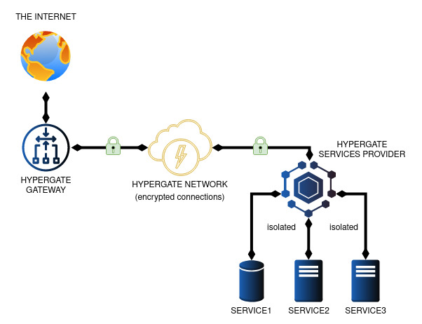
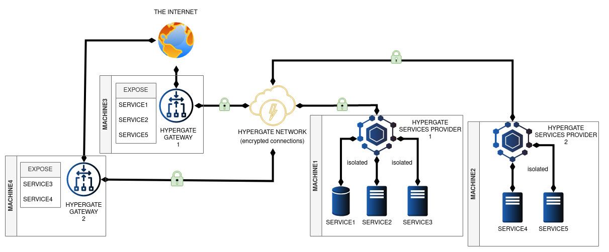
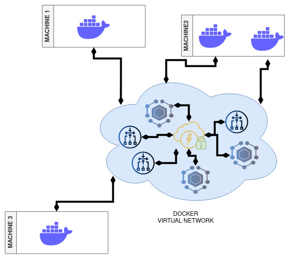

# Hypergate

Hypergate is a zero-configuration, peer-to-peer encrypted tunnel that enables easy communication between Docker containers and physical machines located anywhere, even behind NAT. 

It consists of three main components: 
- **Service Providers**, which make local services available to the network
- **Gateways**, which serve as entrypoints to the network and direct connections to the appropriate Service Provider
- **Hypergate Network**, a virtual network that connects Service Providers and Gateways, represented by a secret key that contains all the information needed to establish a Hyperswarm connection. 

An hypergate network can have multiple Gateways and Service Providers, even on the same machines. 

**If you want to tl;dr directly to the examples, just jump to [Example: Providers-Gateways](#example-1-one-provider-one-gateway-with-docker) or  [Example: Docker Network](#example-2-docker-virtual-network)**


# Usage and Short explanation
There are two main ways to use Hypergate: 

- **Providers-Gateways logic**: This can be done using Docker containers with the help of the hypergate-manager helper script, which will build one provider container and one gateway container for the host machine.
Alternatively, it can be done manually by calling hypergate-cli.js or the hypergate executable within the container or physical machine. In this configuration, there is usually a public-facing gateway that exposes static ports to the internet, linking to underlying services hosted elsewhere.

- **Docker virtual network**: This is done using the hypergate-manager helper script and combines Service Providers, Gateways, and a Docker user-defined bridge network that virtually spans across multiple machines. (kinda like an overlay network)

Both ways can be used together and side-by-side.

The only things you need to get started are:
- If you want to use Hypergate with docker:
    - [Docker](https://www.docker.com/)
    - [hypergate-manager](docker/hypergate-manager) helper script
    - [jq](https://stedolan.github.io/jq/) required by hypergate-manager to parse json data from docker (it is available in most package managers, eg. `apt install jq` on ubuntu)

- If you want to use Hypergate without docker:
    - [NodeJS](https://nodejs.org/en/) 
    - The "hypergate" command line utility from this repo installed with npm (`npm i https://github.com/riccardobl/hypergate.git`) 
    
    or 
    
    - The "hypergate" executable downloaded from the [release page](https://github.com/riccardobl/hypergate/releases). This is a self contained app image that contains the nodejs runtime environment, so you don't need to install nodejs separately. *(Works only on x86_64 linux machines)*
    
# Service Providers-Gateways
 
| One Provider, One Gateway configuration  | Many Providers, Many Gateways configuration |
| ------------- | ------------- |
| <a href="static/gateway-provider.jpg" target="blank"></a>        |<a href="static/multi-gateway-provider.jpg" target="blank"> </a> |

Service Providers are authoritative and are responsible for informing the Gateways of the services they expose by updating their routing table. Gateways are expected to always trust them.
Service Providers advertise their exposed services by specifying ports or providing aliases, both of which are called "gates." 

Ports have this layout: PORT/protocol (e.g. 8080/tcp). 
Aliases are just strings that can be used to identify a service (e.g. "web1"), they also can end with a protocol such as /tcp or /udp.
It is possible to specify a port for an alias (e.g. "web1:8080/tcp"), if no port is specified, the gateway will assign a random one.

Gateways maintain a routing table of expiring routes that link each gate to a list of Service Providers that declare to have the service associated with it. Gateways have the option to select which gates to expose. 

If multiple Service Providers advertise a service on the same gate, the Gateways use round-robin selection to pick the next online one for each connection.

You can have as many providers and gateways you want for each hypergate network.

*It is crucial to protect the Hypergate Network secret as it can be used to reconfigure the entire network by a rogue Service Provider. 
It is recommended to use multiple Hypergate Networks to isolate services if different levels of trust are required.*


# Docker virtual network
| Docker virtual network | 
| ------------- | 
| <a href="static/gateway-provider.jpg" target="blank">  </a>|

The **Hypergate Manager** seamlessly connects all containers on the same network by utilizing **service providers**, **gateways,** and **Docker's user-defined bridge** networks, eliminating the need for complex configuration or port redirects. Utilizing the power of Hyperswarm, Hypergate creates P2P connections through NATs using hole-punching techniques, even for containers that would otherwise be inaccessible. All connections are automatically encrypted for added security.

This is an abstraction on top of the **Providers-Gateways** logic.


# Examples 

## Example 1: One Provider, One Gateway with Docker
In this example we will create a gateway on MACHINE1 that exposes services on MACHINE2.
We will use docker containers and the helper script hypergate-manager, however the same can be done manually by calling hypergate-cli.js or the hypergate executable within the container or physical machine.

### Create Hypergate Network Secret
First we need the network secret, this is a random  32-byte hex string that will be used to identify the network. It is shared between all the machines that will be part of the network.
One quick way to generate it securely is by using openssl or the hypergate-manager helper script.


```bash
openssl rand -hex 32
# or
hypergate-manager utils newSecret 
# Result: aae6437614e28a2f87b7ccacc73332c343fdfe9cf974dcdee4f19611a78f6648
```

### Machine 1: Install hypergate-manager
```bash
curl "https://raw.githubusercontent.com/riccardobl/hypergate/master/docker/hypergate-manager" -o /usr/local/bin/hypergate-manager
chmod +x /usr/local/bin/hypergate-manager
```


### Machine 1: Join the hypergate network 
This will create a local gateway and local provider container to interface with hypergate
```bash
hypergate-manager utils install aae6437614e28a2f87b7ccacc73332c343fdfe9cf974dcdee4f19611a78f6648
```

### Machine 1: Run the services
We will run two simple http servers both listing on port 8080 internally, using the busybox image.
```bash
docker run -d --rm --name=web1 busybox httpd -p 0.0.0.0:8080 -f -h /var/www
docker exec web1 sh -c "echo web1 > /var/www/index.html"

docker run -d --rm --name=web2 busybox httpd -p 0.0.0.0:8080 -f -h /var/www
docker exec web2 sh -c "echo web2 > /var/www/index.html"
```
*Note: The two containers do not expose any port, the gateway on Machine 2 will expose them.*

### Machine 1: Register the services with the provider
Now we will register the two services on gate 8080/tcp (that listents on port 8080 on protocol tcp) and gate 8081/tcp, that connect to the port 8080 of the two containers.
The syntax is 
```bash
hypergate-manager provider connect <secret> <container> <containerPort> <gate>
```
That becomes:

```bash
hypergate-manager provider connect aae6437614e28a2f87b7ccacc73332c343fdfe9cf974dcdee4f19611a78f6648 web1 8080/tcp 8080/tcp

 hypergate-manager provider connect aae6437614e28a2f87b7ccacc73332c343fdfe9cf974dcdee4f19611a78f6648 web2 8080/tcp 8081/tcp
```


### Machine 2: Install hypergate-manager
```bash
curl "https://raw.githubusercontent.com/riccardobl/hypergate/master/docker/hypergate-manager" -o /usr/local/bin/hypergate-manager
chmod +x /usr/local/bin/hypergate-manager
```


### Machine 2: Join the hypergate network 
We join the hypergate network on the second machine, using the same secret
```bash
hypergate-manager utils install aae6437614e28a2f87b7ccacc73332c343fdfe9cf974dcdee4f19611a78f6648
```

### Machine 2: Expose the services with the gateway
We will expose the two services on the gateway, this can be done in two ways:

**By exposing the gates manually**

This will expose the gate 8080/tcp and 8081/tcp by listening on their respective ports: 8080 and 8081 on the protocol tcp
```bash
hypergate-manager gateway expose aae6437614e28a2f87b7ccacc73332c343fdfe9cf974dcdee4f19611a78f6648 8080/tcp

hypergate-manager gateway expose aae6437614e28a2f87b7ccacc73332c343fdfe9cf974dcdee4f19611a78f6648 8081/tcp
```
This is especially useful if you want to expose only some gates on the gateway, eg. for a multiple gateway configuration where from each gateway you want to make only a subset of the services available.


**By exposing all the gates manually**
This will expose all the gates on the gateway, in addition it will close all the gates that are not registered anymore

```bash
hypergate-manager gateway expose aae6437614e28a2f87b7ccacc73332c343fdfe9cf974dcdee4f19611a78f6648 auto
```

This command can be called periodically to keep the gateway up to date with the registered services, using a cronjob or a systemd timer.

*Note: the gateways and providers take some time to find each others, depending on the network conditions, so you might need to wait or call this command a few times before the services are accessible.*


### Machine 2: Test the services
We can now connect to IP_MACHINE2:8080 and IP_MACHINE2:8081 to access the two services.


## Example 2: Docker Virtual Network

This example is much easier than the previous one, as it hides all the provider-gateway logic behind a docker bridge network. The idea is that hypergate-manager connects the services by aliases to the hypergate network and for each of them creates and synchronizes a set of gateways and providers that are connected to a docker bridge network using said aliases as the container aliases, in this way the services are accessible by their aliases for any container connected to the network.


In this example we will host a caddy reverse proxy connected to a wordpress container on MACHINE 1 that use mysql on MACHINE 2 that is also accessible from a phpmyadmin container on the same machine.

All containers will be linked using aliases that end with .hyper, eg. mysql.hyper

### Create Hypergate Network Secret
First we need the network secret, this is a random  32-byte hex string that will be used to identify the network. It is shared between all the machines that will be part of the network.
One quick way to generate it securely is by using openssl or the hypergate-manager helper script.

```bash
openssl rand -hex 32
# or
hypergate-manager utils newSecret 
# Result: aae6437614e28a2f87b7ccacc73332c343fdfe9cf974dcdee4f19611a78f6648
```

### Machine 2: Install hypergate-manager
```bash
curl "https://raw.githubusercontent.com/riccardobl/hypergate/master/docker/hypergate-manager" -o /usr/local/bin/hypergate-manager
chmod +x /usr/local/bin/hypergate-manager
```

### Machine 2: Join the hypergate network 
This will create a local gateway and local provider container to interface with hypergate
```bash
hypergate-manager utils install aae6437614e28a2f87b7ccacc73332c343fdfe9cf974dcdee4f19611a78f6648
```

### Machine 2: Create the docker overlay network

We will create a network called overlay, that will bridge the hypergate network.

```bash
hypergate-manager network create aae6437614e28a2f87b7ccacc73332c343fdfe9cf974dcdee4f19611a78f6648 overlay
```


### Machine 2: Create the containers

```bash
docker run --restart=always --name test-mysql -eMYSQL_ROOT_HOST=% -eMYSQL_DATABASE=wp -e MYSQL_ROOT_PASSWORD=secretpassword -d mysql

docker run --restart=always --name test-phpmyadmin -d -e PMA_HOST=mysql.hyper -p 3307:80 phpmyadmin
```

### Machine 2: Connect the containers

```bash
# Note: syntax is hypergate-manager network connect <secret> <network> <container> <containerPort> <alias>
hypergate-manager network connect aae6437614e28a2f87b7ccacc73332c343fdfe9cf974dcdee4f19611a78f6648 overlay test-mysql 3306/tcp mysql.hyper

hypergate-manager network connect aae6437614e28a2f87b7ccacc73332c343fdfe9cf974dcdee4f19611a78f6648 overlay test-phpmyadmin 80/tcp phpmyadmin.hyper
``` 

### Machine 1: Install hypergate-manager
```bash
curl "https://raw.githubusercontent.com/riccardobl/hypergate/master/docker/hypergate-manager" -o /usr/local/bin/hypergate-manager
chmod +x /usr/local/bin/hypergate-manager
```

### Machine 1: Join the hypergate network 
This will create a local gateway and local provider container to interface with hypergate
```bash
hypergate-manager utils install aae6437614e28a2f87b7ccacc73332c343fdfe9cf974dcdee4f19611a78f6648
```

### Machine 1: Create the docker overlay network

Same as machine 2, this is the network that will bridge to the hypergate network.

```bash
hypergate-manager network create aae6437614e28a2f87b7ccacc73332c343fdfe9cf974dcdee4f19611a78f6648 overlay
```

### Machine 1: Create the containers
```bash
docker run --restart=always  -eWORDPRESS_DB_NAME="wp" -e WORDPRESS_DB_PASSWORD=secretpassword -e WORDPRESS_DB_USER=root -e WORDPRESS_DB_HOST=mysql.hyper:3306 --name test-wordpress -d wordpress

echo "
:80
reverse_proxy  wordpress.hyper:80
 " > /tmp/Caddyfile
docker run  --restart=always  --name test-reverse-proxy -d -p 80:80 -v /tmp/Caddyfile:/etc/caddy/Caddyfile  caddy

```

### Machine 1: Connect the containers

```bash
hypergate-manager network connect aae6437614e28a2f87b7ccacc73332c343fdfe9cf974dcdee4f19611a78f6648 overlay test-wordpress 80/tcp wordpress.hyper

hypergate-manager network connect aae6437614e28a2f87b7ccacc73332c343fdfe9cf974dcdee4f19611a78f6648 overlay test-reverse-proxy 80/tcp reverse.hyper

```

### Machine 1: Expose the remote containers

Now we need to sync the network and expose the remote containers, this can be done manually by calling the expose with the specified alias or automatically (preferred) by calling expose with the auto parameter.

```bash
hypergate-manager network expose aae6437614e28a2f87b7ccacc73332c343fdfe9cf974dcdee4f19611a78f6648 overlay auto
```

Similar to when using the provider-gateway logic, the gateways and providers take some time to find each others, so you might need to wait or call this command a few times before the services are accessible.

*It is advised to add this command to a cronjob or a systemd timer to keep the network up to date.*

### Machine 2: Expose the remote containers
Same but  on machine 2

```bash
hypergate-manager network expose aae6437614e28a2f87b7ccacc73332c343fdfe9cf974dcdee4f19611a78f6648 overlay auto
```

### Test the services
We should be able to access the wordpress site on http://IP_MACHINE1:80 and the phpmyadmin on http://IP_MACHINE2:3307


# License and Warranty

This is an experimental free software, there is no warranty. You are free to use, modify and redistribute it under certain conditions. 

See the [LICENSE](LICENSE) file for details.

This is an experimental software, it might or might not be production ready or even work as expected. 

Use it at your own discretion.

# Similar projects
Other projects related to sharing services with hyperswarm

- [hypertele](https://github.com/bitfinexcom/hypertele) :  A swiss-knife proxy powered by Hyperswarm DHT 
- [hyperseaport](https://github.com/ryanramage/hyperseaport) :  A p2p service registry 
- [hyperssh](https://github.com/mafintosh/hyperssh) :  Run SSH over hyperswarm! 
- [hyperbeam](https://github.com/mafintosh/hyperbeam) :  A 1-1 end-to-end encrypted internet pipe powered by Hyperswarm 